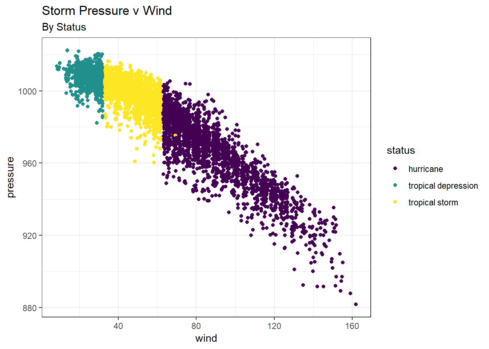

**What environmental signals prompt native fish to leave the floodplain before disconnection with the river and avoid stranding?**

The goal of my current research is to help understand and conserve native salmon (*Oncorhynchus tshawytscha*) populations by better understanding fish utilization of natural, restored, or managed floodplains under varying environmental conditions. The lower Cosumnes River is an ideal place to research these dynamics, as it has no major dams, so the flow is relatively natural, and there is a restored floodplain that can be used to understand timing and use by juvenile salmon and other native
fishes. Information from my research will inform managers and help prioritize restoration efforts
throughout the Central Valley.


```r
library(tidyverse)
library(plotly)
glimpse(storms)
```

```
## Observations: 10,010
## Variables: 13
## $ name        <chr> "Amy", "Amy", "Amy", "Amy", "Amy", "Amy", "Amy", "...
## $ year        <dbl> 1975, 1975, 1975, 1975, 1975, 1975, 1975, 1975, 19...
## $ month       <dbl> 6, 6, 6, 6, 6, 6, 6, 6, 6, 6, 6, 6, 6, 6, 6, 6, 7,...
## $ day         <int> 27, 27, 27, 27, 28, 28, 28, 28, 29, 29, 29, 29, 30...
## $ hour        <dbl> 0, 6, 12, 18, 0, 6, 12, 18, 0, 6, 12, 18, 0, 6, 12...
## $ lat         <dbl> 27.5, 28.5, 29.5, 30.5, 31.5, 32.4, 33.3, 34.0, 34...
## $ long        <dbl> -79.0, -79.0, -79.0, -79.0, -78.8, -78.7, -78.0, -...
## $ status      <chr> "tropical depression", "tropical depression", "tro...
## $ category    <ord> -1, -1, -1, -1, -1, -1, -1, -1, 0, 0, 0, 0, 0, 0, ...
## $ wind        <int> 25, 25, 25, 25, 25, 25, 25, 30, 35, 40, 45, 50, 50...
## $ pressure    <int> 1013, 1013, 1013, 1013, 1012, 1012, 1011, 1006, 10...
## $ ts_diameter <dbl> NA, NA, NA, NA, NA, NA, NA, NA, NA, NA, NA, NA, NA...
## $ hu_diameter <dbl> NA, NA, NA, NA, NA, NA, NA, NA, NA, NA, NA, NA, NA...
```

```r
library(viridis)

ggplot(storms) +
  geom_jitter(aes(wind, pressure, color = status)) +
  scale_color_viridis_d() +
  labs(title = "Storm Pressure v Wind", subtitle = "By Status") +
  theme_bw()
```



Create a table that identifies the mean wind, pressure, ts_diameter, hu_diameter of each status of storm.


```r
library(htmlTable)

storms_tbl <- storms %>% 
  drop_na(ts_diameter, hu_diameter) %>% 
  group_by(status) %>% 
  summarize(mean_wind = mean(wind), mean_pressure = mean(pressure), mean_ts = mean(ts_diameter), mean_hu = mean(hu_diameter))

storms_tbl$mean_wind <- round(storms_tbl$mean_wind, 2)
storms_tbl$mean_pressure <- round(storms_tbl$mean_pressure, 2)
storms_tbl$mean_ts <- round(storms_tbl$mean_ts, 2)
storms_tbl$mean_hu <- round(storms_tbl$mean_hu, 2)

htmlTable(storms_tbl)
```

<table class='gmisc_table' style='border-collapse: collapse; margin-top: 1em; margin-bottom: 1em;' >
<thead>
<tr>
<th style='border-bottom: 1px solid grey; border-top: 2px solid grey;'> </th>
<th style='border-bottom: 1px solid grey; border-top: 2px solid grey; text-align: center;'>status</th>
<th style='border-bottom: 1px solid grey; border-top: 2px solid grey; text-align: center;'>mean_wind</th>
<th style='border-bottom: 1px solid grey; border-top: 2px solid grey; text-align: center;'>mean_pressure</th>
<th style='border-bottom: 1px solid grey; border-top: 2px solid grey; text-align: center;'>mean_ts</th>
<th style='border-bottom: 1px solid grey; border-top: 2px solid grey; text-align: center;'>mean_hu</th>
</tr>
</thead>
<tbody>
<tr>
<td style='text-align: left;'>1</td>
<td style='text-align: center;'>hurricane</td>
<td style='text-align: center;'>87.15</td>
<td style='text-align: center;'>966.35</td>
<td style='text-align: center;'>288.11</td>
<td style='text-align: center;'>72.96</td>
</tr>
<tr>
<td style='text-align: left;'>2</td>
<td style='text-align: center;'>tropical depression</td>
<td style='text-align: center;'>28.21</td>
<td style='text-align: center;'>1006.47</td>
<td style='text-align: center;'>0</td>
<td style='text-align: center;'>0</td>
</tr>
<tr>
<td style='border-bottom: 2px solid grey; text-align: left;'>3</td>
<td style='border-bottom: 2px solid grey; text-align: center;'>tropical storm</td>
<td style='border-bottom: 2px solid grey; text-align: center;'>45.75</td>
<td style='border-bottom: 2px solid grey; text-align: center;'>999.03</td>
<td style='border-bottom: 2px solid grey; text-align: center;'>159.61</td>
<td style='border-bottom: 2px solid grey; text-align: center;'>0.04</td>
</tr>
</tbody>
</table>

CHALLENGE


```r
glimpse(storms)
```

```
## Observations: 10,010
## Variables: 13
## $ name        <chr> "Amy", "Amy", "Amy", "Amy", "Amy", "Amy", "Amy", "...
## $ year        <dbl> 1975, 1975, 1975, 1975, 1975, 1975, 1975, 1975, 19...
## $ month       <dbl> 6, 6, 6, 6, 6, 6, 6, 6, 6, 6, 6, 6, 6, 6, 6, 6, 7,...
## $ day         <int> 27, 27, 27, 27, 28, 28, 28, 28, 29, 29, 29, 29, 30...
## $ hour        <dbl> 0, 6, 12, 18, 0, 6, 12, 18, 0, 6, 12, 18, 0, 6, 12...
## $ lat         <dbl> 27.5, 28.5, 29.5, 30.5, 31.5, 32.4, 33.3, 34.0, 34...
## $ long        <dbl> -79.0, -79.0, -79.0, -79.0, -78.8, -78.7, -78.0, -...
## $ status      <chr> "tropical depression", "tropical depression", "tro...
## $ category    <ord> -1, -1, -1, -1, -1, -1, -1, -1, 0, 0, 0, 0, 0, 0, ...
## $ wind        <int> 25, 25, 25, 25, 25, 25, 25, 30, 35, 40, 45, 50, 50...
## $ pressure    <int> 1013, 1013, 1013, 1013, 1012, 1012, 1011, 1006, 10...
## $ ts_diameter <dbl> NA, NA, NA, NA, NA, NA, NA, NA, NA, NA, NA, NA, NA...
## $ hu_diameter <dbl> NA, NA, NA, NA, NA, NA, NA, NA, NA, NA, NA, NA, NA...
```

```r
duration <- storms %>% 
  filter( year >= 2010, status == "hurricane") %>% 
  group_by(name, year) %>% 
  summarize(duration = diff(range(day)))
```

```
## Warning: package 'bindrcpp' was built under R version 3.4.4
```

```r
#map

map2_chr(duration$name, duration$duration, function(x,y) paste("Hurricane", x, "lasted", y, "days"))
```

```
##  [1] "Hurricane Alex lasted 29 days"    
##  [2] "Hurricane Arthur lasted 2 days"   
##  [3] "Hurricane Chris lasted 0 days"    
##  [4] "Hurricane Cristobal lasted 3 days"
##  [5] "Hurricane Danielle lasted 7 days" 
##  [6] "Hurricane Danny lasted 2 days"    
##  [7] "Hurricane Edouard lasted 4 days"  
##  [8] "Hurricane Ernesto lasted 1 days"  
##  [9] "Hurricane Fay lasted 0 days"      
## [10] "Hurricane Fred lasted 30 days"    
## [11] "Hurricane Gonzalo lasted 6 days"  
## [12] "Hurricane Gordon lasted 2 days"   
## [13] "Hurricane Humberto lasted 2 days" 
## [14] "Hurricane Igor lasted 9 days"     
## [15] "Hurricane Ingrid lasted 2 days"   
## [16] "Hurricane Isaac lasted 1 days"    
## [17] "Hurricane Joaquin lasted 29 days" 
## [18] "Hurricane Julia lasted 3 days"    
## [19] "Hurricane Karl lasted 1 days"     
## [20] "Hurricane Kate lasted 0 days"     
## [21] "Hurricane Katia lasted 9 days"    
## [22] "Hurricane Kirk lasted 30 days"    
## [23] "Hurricane Leslie lasted 6 days"   
## [24] "Hurricane Lisa lasted 1 days"     
## [25] "Hurricane Maria lasted 1 days"    
## [26] "Hurricane Michael lasted 5 days"  
## [27] "Hurricane Nadine lasted 29 days"  
## [28] "Hurricane Nate lasted 1 days"     
## [29] "Hurricane Ophelia lasted 29 days" 
## [30] "Hurricane Otto lasted 1 days"     
## [31] "Hurricane Paula lasted 2 days"    
## [32] "Hurricane Philippe lasted 4 days" 
## [33] "Hurricane Rafael lasted 2 days"   
## [34] "Hurricane Richard lasted 1 days"  
## [35] "Hurricane Rina lasted 3 days"     
## [36] "Hurricane Sandy lasted 5 days"    
## [37] "Hurricane Shary lasted 0 days"    
## [38] "Hurricane Tomas lasted 26 days"
```


